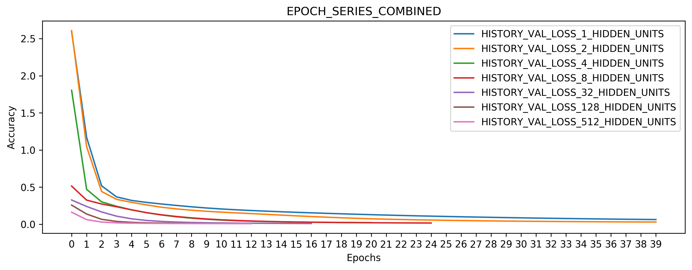
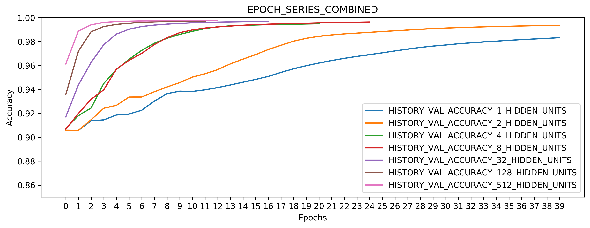
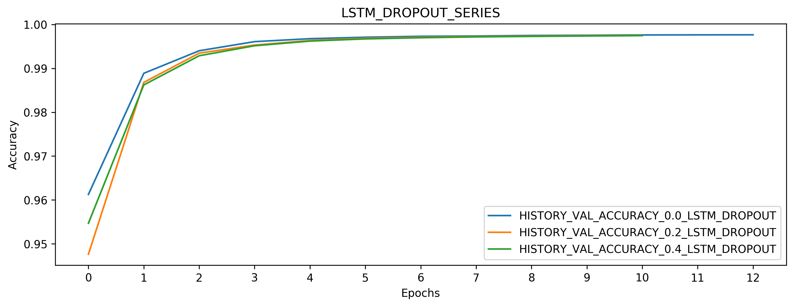

# Part-of-speech Tagging (POS) - Experiments

## Code

### Usage
example command for experiment 1.1 from the paper:

```
python3 pos/pos.py --model BILSTM_CRF --dataset PTB --traincasetype CASED --devcasetype CASED --testcasetype CASED --embedding ELMO --batchsize 1024 --epochs 40 --learningrate 1e-3 --lstmhiddenunits 512 --lstmdropout 0.0 --lstmrecdropout 0.0 --numgpus 2
```

```
usage: pos.py [-h] [-d {PTB,PTB_DUMMY,PTB_REDUCED,BROWN,CONLL2000}]
              [-ctr {CASED,UNCASED,TRUECASE,CASED_UNCASED,HALF_MIXED}]
              [-cte {CASED,UNCASED,TRUECASE,CASED_UNCASED,HALF_MIXED}]
              [-cde {CASED,UNCASED,TRUECASE,CASED_UNCASED,HALF_MIXED}]
              [-v {NO,LIMITED,FULL}] [-e {GLOVE,WORD2VEC,ELMO}]
              [-w {GOOGLE_NEWS_300}] [-g {COMMON_CRAWL_840B_CASED_300D}]
              [-b BATCHSIZE] [-p EPOCHS] [-m {BILSTM,BILSTM_CRF}]
              [-ng NUMGPUS] [-lr LEARNINGRATE] [-hu LSTMHIDDENUNITS]
              [-dr LSTMDROPOUT] [-rdr LSTMRECDROPOUT] [-s {True,False}]
              [-c CUDADEVICES]

optional arguments:
  -h, --help            show this help message and exit
  -d {PTB,PTB_DUMMY,PTB_REDUCED,BROWN,CONLL2000}, --dataset {PTB,PTB_DUMMY,PTB_REDUCED,BROWN,CONLL2000}
  -ctr {CASED,UNCASED,TRUECASE,CASED_UNCASED,HALF_MIXED}, --traincasetype {CASED,UNCASED,TRUECASE,CASED_UNCASED,HALF_MIXED}
  -cte {CASED,UNCASED,TRUECASE,CASED_UNCASED,HALF_MIXED}, --testcasetype {CASED,UNCASED,TRUECASE,CASED_UNCASED,HALF_MIXED}
  -cde {CASED,UNCASED,TRUECASE,CASED_UNCASED,HALF_MIXED}, --devcasetype {CASED,UNCASED,TRUECASE,CASED_UNCASED,HALF_MIXED}
  -v {NO,LIMITED,FULL}, --loglevel {NO,LIMITED,FULL}
  -e {GLOVE,WORD2VEC,ELMO}, --embedding {GLOVE,WORD2VEC,ELMO}
  -w {GOOGLE_NEWS_300}, --datasource_word2vec {GOOGLE_NEWS_300}
  -g {COMMON_CRAWL_840B_CASED_300D}, --datasource_glove {COMMON_CRAWL_840B_CASED_300D}
  -b BATCHSIZE, --batchsize BATCHSIZE
  -p EPOCHS, --epochs EPOCHS
  -m {BILSTM,BILSTM_CRF}, --model {BILSTM,BILSTM_CRF}
  -ng NUMGPUS, --numgpus NUMGPUS
  -lr LEARNINGRATE, --learningrate LEARNINGRATE
  -hu LSTMHIDDENUNITS, --lstmhiddenunits LSTMHIDDENUNITS
  -dr LSTMDROPOUT, --lstmdropout LSTMDROPOUT
  -rdr LSTMRECDROPOUT, --lstmrecdropout LSTMRECDROPOUT
  -s {True,False}, --hyperparamsearch {True,False}
  -c CUDADEVICES, --cudadevices CUDADEVICES
```

### Data Import


### Sequence Padding


### Embedding


### Label Mapping

### Model


### Misc

#### Early Stopping

#### Hyperparameter Search

#### True Accuracy Report

#### Save / Load Model


## Hyperparameter Search
TODO

### Dataset Split


### Parameters

#### LSTM Hidden Units




#### Learning Rate
")

")

#### Dropout




## Paper Experiments Reproduction
TODO

## Additional Experiments
TODO


## Computing Infrastructure
We used the following compute infrastructure to run the experiments:

  * __CPU__: AMD EPYC 7501 (64 cores / 128 threads)
  * __GPU__: 2x Nvidia V100 (32GB PCIe) \*
  * __Memory__: 512GB

\* the CRF layer does not have multi GPU support yet


## Evaluation

example command for the "Validation Accuracy over Time" plot:
```
python3 pos/evaluation.py --plot EPOCH_SERIES_COMBINED --dataset HISTORY_VAL_ACCURACY
```

```
usage: evaluation.py [-h]
                     [-d {DEV_ACCURACY,TEST_ACCURACY,HISTORY_ACCURACY,HISTORY_EPOCH,HISTORY_LOSS,HISTORY_VAL_ACCURACY,HISTORY_VAL_LOSS}]
                     [-p {LSTM_HIDDEN_UNITS_SERIES,LSTM_HIDDEN_UNITS_SERIES_COMBINED,EPOCH_SERIES,EPOCH_SERIES_COMBINED,LEARNING_RATE_SERIES,LSTM_DROPOUT_SERIES}]

optional arguments:
  -h, --help            show this help message and exit
  -d {DEV_ACCURACY,TEST_ACCURACY,HISTORY_ACCURACY,HISTORY_EPOCH,HISTORY_LOSS,HISTORY_VAL_ACCURACY,HISTORY_VAL_LOSS}, --dataset {DEV_ACCURACY,TEST_ACCURACY,HISTORY_ACCURACY,HISTORY_EPOCH,HISTORY_LOSS,HISTORY_VAL_ACCURACY,HISTORY_VAL_LOSS}
  -p {LSTM_HIDDEN_UNITS_SERIES,LSTM_HIDDEN_UNITS_SERIES_COMBINED,EPOCH_SERIES,EPOCH_SERIES_COMBINED,LEARNING_RATE_SERIES,LSTM_DROPOUT_SERIES}, --plot {LSTM_HIDDEN_UNITS_SERIES,LSTM_HIDDEN_UNITS_SERIES_COMBINED,EPOCH_SERIES,EPOCH_SERIES_COMBINED,LEARNING_RATE_SERIES,LSTM_DROPOUT_SERIES}

```
